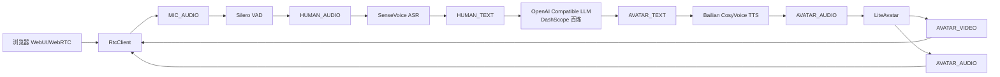
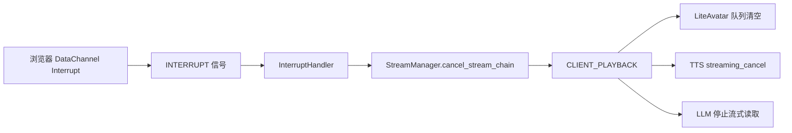

# OpenAvatarChat 项目介绍

本文档基于远端 Ubuntu 项目 `/home/jack/OpenAvatarChat` 的实际文件结构和源码阅读整理。本机启动脚本位于 `C:\Users\11215\Desktop\数字人项目\Liveavatar+阿里api数字人\avatar_start.bat`，脚本通过 SSH 登录 `jack@10.10.2.250`，在远端执行 `cd /home/jack/OpenAvatarChat && docker compose up -d && docker compose ps`。

说明中不会记录 `.env` 或 API Key 的真实值。当前 Docker Compose 服务已被关闭，需要再次启动时运行本机 `avatar_start.bat` 或在远端项目目录执行 `docker compose up -d`。

## 1. 项目定位

OpenAvatarChat 是一个模块化交互数字人对话项目。它把浏览器端 WebRTC 音视频输入、语音活动检测、语音识别、大模型回复、语音合成和数字人驱动拆成多个 Handler，并通过 YAML 配置把这些 Handler 组合成不同运行模式。

当前本机脚本启动的模式是：

`浏览器 WebRTC -> Silero VAD -> SenseVoice ASR -> 阿里百炼 OpenAI 兼容 LLM -> 阿里百炼 CosyVoice TTS -> LiteAvatar 数字人 -> WebRTC 返回音视频`

核心能力包括：

- WebRTC 音视频实时通信，服务端通过 FastAPI、Gradio 和 fastrtc 挂载前端与 RTC 通道。
- ASR、LLM、TTS、Avatar 高度模块化，配置文件里改 `module` 即可替换实现。
- 支持 LiteAvatar、LAM、MuseTalk、FlashHead 等数字人后端。
- 支持单工和双工模式，双工模式可在数字人播报时检测用户插话并打断上游 LLM/TTS/Avatar 流。
- 支持 Agent Beta 模式，引入视觉感知、工具调用、人格/记忆和 OpenClaw 桥接。

## 2. 当前启动与部署方式

### 2.1 本机启动脚本

本机 `avatar_start.bat` 内容等价于：

```bat
ssh jack@10.10.2.250 "cd /home/jack/OpenAvatarChat && docker compose up -d && docker compose ps"
```

启动后访问地址：

```text
https://10.10.2.250:8282
```

### 2.2 Docker Compose

远端 `/home/jack/OpenAvatarChat/docker-compose.yml` 定义两个服务：

| 服务 | 作用 | 关键实现 |
|---|---|---|
| `coturn` | TURN/STUN 中继服务 | 使用 `coturn/coturn` 镜像，挂载 `coturn-data/turnserver.conf` 和 `ssl_certs`，`network_mode: host` |
| `open-avatar-chat` | 主应用容器 | 使用 `open-avatar-chat:latest`，挂载 `build`、`models`、`ssl_certs`、`config`、`.env`、`exp`、`resource`、LiteAvatar 权重目录，映射 `8282:8282`，声明 NVIDIA GPU |

主容器的命令为：

```bash
--config=/root/open-avatar-chat/config/chat_with_openai_compatible_bailian_cosyvoice.yaml
```

因此当前默认配置就是 `config/chat_with_openai_compatible_bailian_cosyvoice.yaml`。

### 2.3 Dockerfile 与依赖

项目使用 CUDA 12.8 + cuDNN 的 Ubuntu 22.04 镜像，安装 Python 3.11、ffmpeg、OpenCV 相关系统库、音频库和构建工具。Python 依赖由 `uv` 管理，根项目依赖在 `pyproject.toml`，各 Handler 也可以有自己的 `pyproject.toml`。

`install.py` 会根据配置文件里的 Handler 自动收集对应模块依赖，并统一解决版本冲突。比如：

- 固定 `torch==2.8.0`、`torchvision==0.23.0`、`torchaudio==2.8.0`。
- 将 `onnxruntime` 替换为 `onnxruntime-gpu`。
- 对 `numpy`、`opencv-python`、`transformers`、`diffusers`、`accelerate` 等做版本约束，避免各数字人模块之间冲突。

## 3. 项目文件夹层级说明

```text
/home/jack/OpenAvatarChat
├── .env
├── .gitmodules
├── Dockerfile
├── Dockerfile.default
├── Dockerfile.local
├── docker-compose.yml
├── pyproject.toml
├── README.md
├── readme_en.md
├── build/
├── config/
├── coturn-data/
├── docker_build_config/
├── docs/
├── exp/
├── extensions/
├── models/
├── resource/
├── scripts/
├── ssl_certs/
├── src/
└── wheelhouse/
```

### 3.1 根目录文件

| 路径 | 作用 |
|---|---|
| `README.md` / `readme_en.md` | 项目说明、快速开始、预置模式列表、社区和引用信息 |
| `pyproject.toml` | 根项目 Python 依赖和 `uv` 配置，Python 版本要求为 `>=3.11.7,<3.12` |
| `docker-compose.yml` | 生产启动入口，编排 coturn 和 OpenAvatarChat 主容器 |
| `Dockerfile` / `Dockerfile.default` / `Dockerfile.local` | 镜像构建文件，CUDA 12.8 环境，安装核心和 Handler 依赖 |
| `install.py` | 根据配置文件解析启用 Handler，并安装对应依赖 |
| `.gitmodules` | 外部子模块清单，包括 LiteAvatar、Silero VAD、CosyVoice、LAM、MuseTalk、Smart Turn、FlashHead、WebUI |
| `.env` | 运行时环境变量，通常放 API Key，不应写入文档或提交 |

### 3.2 `config/`

配置文件目录，项目通过 `--config` 选择启动模式。当前启动使用：

```text
config/chat_with_openai_compatible_bailian_cosyvoice.yaml
```

当前配置的服务参数：

| 配置项 | 当前值 | 说明 |
|---|---|---|
| `service.host` | `0.0.0.0` | 监听所有网卡 |
| `service.port` | `8282` | HTTPS 服务端口 |
| `service.cert_file` | `ssl_certs/localhost.crt` | HTTPS 证书 |
| `service.cert_key` | `ssl_certs/localhost.key` | HTTPS 私钥 |
| `chat_engine.model_root` | `models` | 模型根目录 |
| `chat_engine.concurrent_limit` | `2` | Handler 并发限制 |
| `chat_engine.handler_search_path` | `src/handlers` | Handler 动态加载搜索路径 |

当前启用 Handler：

| Handler 名 | 模块路径 | 功能 |
|---|---|---|
| `RtcClient` | `client/rtc_client/client_handler_rtc` | WebRTC 客户端接入 |
| `InterruptHandler` | `logic/interrupt/interrupt_handler` | 统一处理打断信号 |
| `SileroVad` | `vad/silerovad/vad_handler_silero` | 语音活动检测 |
| `SenseVoice` | `asr/sensevoice/asr_handler_sensevoice` | 本地 FunASR SenseVoice 语音识别 |
| `CosyVoice` | `tts/bailian_tts/tts_handler_cosyvoice_bailian` | 阿里百炼 CosyVoice 语音合成 |
| `LLMOpenAICompatible` | `llm/openai_compatible/llm_handler_openai_compatible` | OpenAI 兼容 LLM 调用，当前指向阿里百炼 |
| `LiteAvatar` | `avatar/liteavatar/avatar_handler_liteavatar` | LiteAvatar 音频驱动数字人视频 |

预置模式还包括 LAM、MuseTalk、FlashHead、双工、Agent、Edge TTS、Qwen Omni 等。

### 3.3 `src/`

核心源码目录：

```text
src/
├── demo.py
├── chat_engine/
├── engine_utils/
├── handlers/
├── logics/
├── service/
└── third_party/
```

| 目录 | 作用 |
|---|---|
| `src/demo.py` | 应用入口，解析参数，加载配置，创建 FastAPI/Gradio，初始化 ChatEngine，启动 Uvicorn |
| `src/chat_engine/` | 会话引擎、Handler 编排、流管理、信号管理、数据模型 |
| `src/engine_utils/` | 通用工具，包括音频处理、路径、导入、切片、计时、文本过滤 |
| `src/handlers/` | 各功能 Handler，ASR、LLM、TTS、Avatar、Client、VAD、Agent 等 |
| `src/service/` | 前端静态服务、RTC 服务、TURN 配置、管理端 WebSocket 服务 |
| `src/logics/` | 逻辑扩展，目前有延迟分析逻辑 |
| `src/third_party/` | 第三方适配或打包依赖 |

### 3.4 `models/`

模型目录。当前实际看到的主要内容：

```text
models/
├── iic/SenseVoiceSmall/
└── musetalk/s3fd-619a316812/
```

当前配置中的 SenseVoice 会优先查找 `models/iic/SenseVoiceSmall`。如果本地存在就走本地路径，否则由 ModelScope/FunASR 机制按模型名加载。

### 3.5 `resource/`

数字人素材目录：

```text
resource/
└── avatar/
    ├── flashhead/girl.png
    ├── liteavatar/20250408/sample_data.zip
    └── put_avatar_here.txt
```

当前 LiteAvatar 配置使用 `avatar_name: 20250408/sample_data`，对应 `resource/avatar/liteavatar/20250408/sample_data.zip`。

### 3.6 `scripts/`

辅助脚本目录，主要用于证书、模型和权重下载：

| 脚本 | 作用 |
|---|---|
| `create_ssl_certs.sh` | 创建本地 HTTPS 证书 |
| `setup_coturn.sh` | 配置 coturn |
| `download_models.py` | 按 Handler 下载所需模型 |
| `download_avatar_model.py` | 下载 Avatar 素材/模型 |
| `download_liteavatar_weights.sh` | 下载 LiteAvatar 权重 |
| `download_musetalk_weights.sh` | 下载 MuseTalk 权重 |
| `download_smart_turn_weights.sh` | 下载 Smart Turn EOU 权重 |

### 3.7 `docs/`

VitePress 文档站点，包含中英文文档。重点文档：

| 路径 | 内容 |
|---|---|
| `docs/guide/how-it-works.md` | 数据流和整体工作原理 |
| `docs/reference/configuration.md` | 配置参数说明 |
| `docs/reference/preset-modes.md` | 预置模式说明 |
| `docs/beta/chat-agent.md` | Agent 与 OpenClaw 集成说明 |

### 3.8 `extensions/`

扩展目录，目前主要是：

```text
extensions/openclaw/oac-bridge/
```

这是 Agent Beta 模式使用的 OpenClaw 桥接插件，用于 OAC 和 OpenClaw Gateway 之间双向通信、工具调用、任务通知和人格/记忆读取。

## 4. 运行主链路

当前配置的数据流如下：



打断链路如下：



## 5. 核心引擎实现

### 5.1 `src/demo.py`

`demo.py` 是启动入口，职责如下：

1. 解析 `--host`、`--port`、`--config`、`--env`。
2. 调用 `load_configs()` 读取 YAML，并用 Pydantic 模型校验为 logger、service、engine 三类配置。
3. 创建 FastAPI 应用，同时挂一个极简 Gradio Blocks 容器用于兼容挂载。
4. 创建 `ChatEngine` 并调用 `initialize()`。
5. 根据证书配置创建 SSL 上下文，使用 Uvicorn 启动 HTTPS 服务。
6. 在 Uvicorn shutdown 时调用 `chat_engine.shutdown()`，销毁 Handler。

代码里还对 `torch.load` 做了补丁，让未显式指定 `weights_only=True` 的加载走 `weights_only=False`，兼容一些模型权重加载方式。

### 5.2 `chat_engine/chat_engine.py`

`ChatEngine` 是总控对象，主要字段：

| 字段 | 作用 |
|---|---|
| `engine_config` | 全局引擎配置 |
| `handler_manager` | 动态加载和管理 Handler |
| `logic_manager` | 动态加载 Logic |
| `sessions` | 当前会话字典，`session_id -> ChatSession` |

初始化时会：

- 加载 `.env`。
- 注册 `/version`、`/liveness`、`/readiness` 健康检查接口。
- 把 `model_root` 解析成绝对路径。
- 初始化并加载所有启用的 Handler。
- 加载启用的 Logic。

创建会话时，`ChatEngine` 会为每个非 Client Handler 创建上下文，然后由 Client Handler 自己在 WebRTC 连接建立时补齐客户端上下文。

### 5.3 `chat_engine/core/handler_manager.py`

`HandlerManager` 负责按 YAML 动态加载模块。配置里的：

```yaml
LiteAvatar:
  module: avatar/liteavatar/avatar_handler_liteavatar
```

会在 `handler_search_path` 下解析为 `src/handlers/avatar/liteavatar/avatar_handler_liteavatar.py`，再从模块里找到符合 `HandlerBase` 的类并实例化。

每个 Handler 通过 `get_handler_info()` 返回自己的 `config_model`，引擎再用这个模型校验 YAML 配置。注册时会把 `handler_root` 注入给 Handler，方便 Handler 找自己的子模块、权重或资源。

### 5.4 `chat_engine/core/chat_session.py`

`ChatSession` 是一次客户端连接的运行环境。它做三件事：

1. 为每个 Handler 创建 `HandlerContext`。
2. 根据 Handler 声明的输入输出类型建立数据队列和 Streamer。
3. 为每个 Handler 启动一个 pump 线程，循环从输入队列取 `ChatData` 并调用 `handler.handle()`。

Handler 之间不是直接互相调用，而是通过 `ChatDataType` 路由。例如 VAD 输出 `HUMAN_AUDIO`，ASR 声明输入 `HUMAN_AUDIO`，引擎就会把 VAD 输出分发给 ASR 的队列。

`ChatSession` 还负责自动记录部分文本流到 `SessionHistory`，例如 `HUMAN_TEXT`、`AVATAR_TEXT`、`HUMAN_DUPLEX_AUDIO`。这为双工打断和语义判断提供时间线。

### 5.5 `chat_engine/core/stream_manager.py`

`StreamManager` 是项目低延迟和可打断能力的核心。它把每段数据都放进一个可追踪的 Stream：

| 概念 | 说明 |
|---|---|
| `ChatStream` | 一个数据流实例，有状态 `NOT_STARTED`、`STARTED`、`ENDED`、`CANCELLED` |
| `ChatStreamer` | 某个 Handler 某种输出类型的流创建器 |
| `StreamStorage` | 维护所有活跃流、父子关系、引用关系和回收 |
| `ChatDataSubmitter` | HandlerContext 中提交输出的统一接口 |

关键实现点：

- 输出流可以自动引用当前输入流，形成父子链路。例如 `HUMAN_AUDIO -> HUMAN_TEXT -> AVATAR_TEXT -> AVATAR_AUDIO -> CLIENT_PLAYBACK`。
- `cancel_stream_chain()` 可以从任意下游流向上追溯，取消所有可取消祖先。
- `CLIENT_PLAYBACK` 是生命周期流，本身不传真实音视频，只标记客户端正在播放数字人输出。打断时优先取消它，再级联取消上游。
- Stream 开始、结束、取消都会通过 `SignalManager` 发出 `STREAM_BEGIN`、`STREAM_END`、`STREAM_CANCEL`。

### 5.6 `chat_engine/core/signal_manager.py`

`SignalManager` 维护一个信号队列和分发线程。Handler 可以声明感兴趣的 `SignalFilterRule`，按以下维度过滤：

- 信号类型，如 `STREAM_CANCEL`、`INTERRUPT`、`SEMANTIC_WAIT`。
- 信号来源，如客户端或 Handler。
- 关联 Stream 的数据类型，如 `CLIENT_PLAYBACK`、`AVATAR_AUDIO`。

这让打断、播放状态、语义等待、候选结束等控制信息可以和音视频数据解耦。

### 5.7 `chat_engine/contexts/session_history.py`

`SessionHistory` 是会话级时间线。它记录：

- Stream 开始、结束、取消。
- 人类文本、数字人文本。
- 客户端播放生命周期。
- 事件 owner、关联事件、父事件、stream key 快照。

双工模式会用它判断：

- 数字人在某个时间点是否正在说话：`was_avatar_speaking_at(timestamp)`。
- 当前是否存在活跃播放流：`get_active_avatar_streams()`。
- 某类 Stream 的开始时间：`get_stream_start_time()`。

### 5.8 `chat_engine/data_models/`

数据模型定义了引擎内部协议：

| 文件/概念 | 作用 |
|---|---|
| `chat_data_type.py` | 定义 `MIC_AUDIO`、`HUMAN_AUDIO`、`HUMAN_TEXT`、`AVATAR_TEXT`、`AVATAR_AUDIO`、`AVATAR_VIDEO`、`CLIENT_PLAYBACK` 等类型 |
| `chat_data_model.py` | `ChatData`，携带类型、时间戳、stream id、数据包、首包/尾包标记 |
| `data_bundle.py` | `DataBundle` 和 `DataBundleDefinition`，用于描述音频、视频、文本、动作数据结构 |
| `chat_signal.py` | `ChatSignal` 和过滤规则 |
| `chat_stream_config.py` | Stream 是否可取消、是否自动关联输入流、是否转发取消 |

## 6. 当前启用模块详解

### 6.1 RtcClient

文件：

```text
src/handlers/client/rtc_client/client_handler_rtc.py
src/service/rtc_service/rtc_stream.py
```

功能：

- 挂载 WebRTC 音视频收发。
- 接收浏览器麦克风音频和摄像头画面，转换为 `MIC_AUDIO` 和 `CAMERA_VIDEO`。
- 接收浏览器文字消息，转换为 `HUMAN_TEXT`。
- 将下游产生的 `AVATAR_AUDIO`、`AVATAR_VIDEO`、`AVATAR_TEXT` 返回浏览器。
- 通过 DataChannel 接收 `Interrupt` 和 `SendHumanText` 等消息。

实现方式：

- 使用 `fastrtc.Stream` 作为 WebRTC 封装。
- 使用 `aiortc`，在导入 fastrtc 前修改 H.264 编码策略，优先选择 `h264_nvenc`、`h264_qsv`、`h264_videotoolbox`，失败则回退 `libx264`。
- `RtcStream.start_up()` 为每个 WebRTC 连接创建或复用 `ClientSessionDelegate`，从而创建 `ChatSession`。
- `receive()` 接收音频帧，`video_receive()` 接收视频帧，写入引擎。
- `emit()` 和 `video_emit()` 从客户端 delegate 的输出队列取数字人音频/视频，返回浏览器。
- DataChannel 收到 `Interrupt` 后发出 `ChatSignalType.INTERRUPT`，由 `InterruptHandler` 统一处理。

输入输出：

| 方向 | 类型 |
|---|---|
| 浏览器到引擎 | `MIC_AUDIO`、`CAMERA_VIDEO`、`HUMAN_TEXT` |
| 引擎到浏览器 | `AVATAR_AUDIO`、`AVATAR_VIDEO`、`AVATAR_TEXT`、`HUMAN_TEXT` 回显 |

### 6.2 SileroVad

文件：

```text
src/handlers/vad/silerovad/vad_handler_silero.py
```

功能：

- 从连续麦克风音频中识别用户说话开始和结束。
- 输出干净的 `HUMAN_AUDIO` 片段给 ASR。
- 在单工模式下，数字人播放时暂停收音，播放结束后恢复。
- 支持判停后的短时监控和重连，减少用户短暂停顿被错误截断的问题。

实现方式：

- 使用 `onnxruntime` 加载 `silero_vad.onnx`，CPU 推理。
- 音频按 512 sample 切片。
- 使用 A-weighting RMS 计算音量，并结合 `speaking_threshold`、`volume_threshold` 判断语音。
- 使用 `AutoGainControl` 做音量增益。
- 状态机包括 `END`、`PRE_START`、`START`、`POST_END`。
- `PRE_START` 达到 `start_delay` 后回溯 `buffer_look_back`，把说话开始前一小段音频也送出。
- `START` 达到 `end_delay` 或收到 EOU 候选结束后进入 `POST_END`。
- `POST_END` 继续监听，如果很快又检测到说话，会取消上一段已结束 Stream 并把缓存音频合并到新 Stream。
- 监听 `CLIENT_PLAYBACK` 的 `STREAM_BEGIN/END/CANCEL`，单工模式下播放时关闭输入。

输入输出：

| 输入 | 输出 |
|---|---|
| `MIC_AUDIO` | `HUMAN_AUDIO` |

### 6.3 SenseVoice ASR

文件：

```text
src/handlers/asr/sensevoice/asr_handler_sensevoice.py
```

功能：

- 将 VAD 输出的 `HUMAN_AUDIO` 转写为 `HUMAN_TEXT`。

实现方式：

- 使用 FunASR `AutoModel` 加载 `iic/SenseVoiceSmall`。
- 如果 `models/iic/SenseVoiceSmall` 存在，优先使用本地模型路径。
- 将输入音频按 16000 sample 切片缓存。
- 当 `inputs.is_last_data=True` 时 flush 剩余音频，拼接成整段送入 `model.generate()`。
- 用正则去掉 SenseVoice 输出里的 `<|...|>` 标签。
- 输出文本通过 `DataBundle` 提交并结束文本 Stream。

输入输出：

| 输入 | 输出 |
|---|---|
| `HUMAN_AUDIO` | `HUMAN_TEXT` |

### 6.4 LLMOpenAICompatible

文件：

```text
src/handlers/llm/openai_compatible/llm_handler_openai_compatible.py
src/handlers/llm/openai_compatible/chat_history_manager.py
```

功能：

- 接收用户文本，调用 OpenAI 兼容接口生成数字人回复文本。
- 当前配置指向阿里百炼兼容模式：`https://dashscope.aliyuncs.com/compatible-mode/v1`。
- 当前模型名为 `qwen3.6-flash`。

实现方式：

- 使用 `openai.OpenAI` 客户端，`api_key` 优先来自配置或环境变量。
- 每个会话创建 `ChatHistory`，按 `history_length` 维护上下文。
- `stream=True` 调用 `chat.completions.create()`，边生成边输出 `AVATAR_TEXT`。
- 输出 Stream 设置为 `cancelable=True`，可被打断链路取消。
- 监听 `STREAM_CANCEL`，如果当前 LLM 输出流被取消，会从 `active_stream_keys` 中移除并关闭 streaming completion。
- 支持 `enable_video_input`，如果启用会把最近摄像头画面加入上下文，但当前配置为 `False`。

输入输出：

| 输入 | 输出 |
|---|---|
| `HUMAN_TEXT`，可选 `CAMERA_VIDEO` | `AVATAR_TEXT` |

### 6.5 Bailian CosyVoice TTS

文件：

```text
src/handlers/tts/bailian_tts/tts_handler_cosyvoice_bailian.py
```

功能：

- 将 LLM 输出的 `AVATAR_TEXT` 流式合成为 `AVATAR_AUDIO`。
- 当前配置使用阿里百炼 CosyVoice，`voice: longanhuan`，`model_name: cosyvoice-v3-plus`。

实现方式：

- 使用 `dashscope.audio.tts_v2.SpeechSynthesizer`。
- 每个输入文本 Stream 建一个 `BailianTTSSession`，内部维护 synthesizer。
- 非尾包时调用 `streaming_call(text)`，尾包时调用 `streaming_complete()`。
- 回调 `on_data()` 收到 PCM bytes 后，积累到一定长度，转成 float32 音频数组并提交 `AVATAR_AUDIO`。
- `on_complete()` flush 剩余音频，并提交一小段静音尾帧来结束 Stream。
- 监听 `STREAM_CANCEL`，可以取消输入 Stream 或输出 Stream 对应的 synthesizer，调用 `streaming_cancel()`。

输入输出：

| 输入 | 输出 |
|---|---|
| `AVATAR_TEXT` | `AVATAR_AUDIO`，24kHz 单声道 |

### 6.6 LiteAvatar

文件：

```text
src/handlers/avatar/liteavatar/avatar_handler_liteavatar.py
src/handlers/avatar/liteavatar/avatar_processor.py
src/handlers/avatar/liteavatar/liteavatar_worker.py
src/handlers/avatar/liteavatar/liteavatar_handler_context.py
src/handlers/avatar/liteavatar/liteavatar_worker_manager.py
```

功能：

- 接收 TTS 音频，生成数字人视频帧，并把原始/对齐后的数字人音频返回客户端。
- 当前配置使用 `avatar_name: 20250408/sample_data`，`fps: 25`，`use_gpu: true`。

实现方式：

- `LiteAvatarWorkerManager` 按 `concurrent_limit` 创建多个 `LiteAvatarWorker`。
- 每个 Worker 是独立子进程，使用 `torch.multiprocessing` 的 `spawn` 模式。
- 子进程中创建 `AvatarProcessor`，内部有三条线程：
  - `audio2signal_loop`：音频切片转换成面部/嘴型信号。
  - `signal2img_loop`：信号生成嘴部图像，空闲时生成 listening idle 帧。
  - `mouth2full_loop`：嘴部图像合成完整画面，同时生成音频帧和视频帧。
- 父进程和子进程用 multiprocessing Queue 传控制事件，用 shared memory 传音频/视频大数组，降低复制开销。
- `HandlerTts2FaceContext` 后台线程从 Worker 输出队列读 shared memory，封装成 `AVATAR_AUDIO` 和 `AVATAR_VIDEO`。
- 每当收到新的 TTS `AVATAR_AUDIO` Stream，会创建一个 `CLIENT_PLAYBACK` 生命周期流，表示客户端即将播放数字人语音。
- 收到 `CLIENT_PLAYBACK STREAM_CANCEL` 时，清空音频、信号、图像队列，并发 `INTERRUPT` 事件给子进程，停止残留输出。

输入输出：

| 输入 | 输出 |
|---|---|
| `AVATAR_AUDIO` | `AVATAR_AUDIO`、`AVATAR_VIDEO` |

### 6.7 InterruptHandler

文件：

```text
src/handlers/logic/interrupt/interrupt_handler.py
```

功能：

- 集中处理打断，不把取消逻辑散落在 VAD、LLM、TTS、Avatar 中。

实现方式：

- 监听所有来源的 `ChatSignalType.INTERRUPT`。
- 如果信号带 `related_stream`，调用 `StreamManager.cancel_stream_chain(related_stream)`。
- 如果没有指定目标，就查找活跃 `CLIENT_PLAYBACK` Stream，再取消它的祖先链。
- 被取消的流会发出 `STREAM_CANCEL`，LLM、TTS、Avatar 各自监听并停止自己的处理。
- 同时把打断事件写入 `SessionHistory`。

## 7. 其他可选模块

### 7.1 客户端模块

| 模块 | 路径 | 用途 |
|---|---|---|
| RTC Client | `handlers/client/rtc_client` | 当前使用，标准 WebRTC 音视频浏览器接入 |
| WS Client | `handlers/client/ws_client` | WebSocket 文本/二进制协议，包含 message protocol 和 opus codec |
| WS LAM Client | `handlers/client/ws_lam_client` | LAM 场景使用的 WebSocket 客户端，配有 sample zip |

### 7.2 VAD 和端点检测模块

| 模块 | 路径 | 用途 |
|---|---|---|
| Silero VAD | `handlers/vad/silerovad/vad_handler_silero.py` | 当前单工 VAD |
| Duplex VAD | `handlers/vad/silerovad/duplex_vad_handler.py` | 双工模式始终监听麦克风，输出 `HUMAN_DUPLEX_AUDIO` |
| Smart Turn EOU | `handlers/vad/smart_turn_eou/eou_handler_smart_turn.py` | 旁路监听人声，用 ONNX Smart Turn 判断话轮是否完整，向 VAD 发候选 `STREAM_END` |

双工 VAD 会在用户开始说话时记录“数字人当时是否正在播放”，把 `avatar_was_speaking_at_stream_start` 写入可继承 metadata，下游语义打断模块据此判断这段话是正常提问还是打断。

### 7.3 ASR 模块

| 模块 | 路径 | 用途 |
|---|---|---|
| SenseVoice | `handlers/asr/sensevoice` | 当前使用，本地 FunASR 模型 |
| Bailian ASR | `handlers/asr/bailian_asr` | 阿里百炼 WebSocket ASR，支持实时识别、语义标点、语言提示 |

Bailian ASR 会把输入音频转成 int16 PCM bytes，按约 100ms chunk 通过 DashScope Recognition WebSocket 发送。它也监听 `STREAM_CANCEL`，在打断时清理当前识别 session。

### 7.4 LLM 与语义模块

| 模块 | 路径 | 用途 |
|---|---|---|
| OpenAI Compatible | `handlers/llm/openai_compatible` | 当前使用，支持阿里百炼、Ollama、Gemini OpenAI 兼容接口等 |
| Qwen Omni | `handlers/llm/qwen_omni` | Qwen-Omni 多模态模型模式 |
| Dify | `handlers/llm/dify` | 接入 Dify 工作流/应用 |
| Semantic Turn Detector | `handlers/llm/semantic_turn_detector` | 双工语义打断和语义话轮完成检测 |

Semantic Turn Detector 在双工模式里接收 `HUMAN_DUPLEX_TEXT`、`HUMAN_DUPLEX_AUDIO`、`HUMAN_DUPLEX_TEXT_PARTIAL`。它通过 LLM prompt 判断用户是否真要打断，或当前话是否还没说完。判断未完成时会发 `SEMANTIC_WAIT` 延长 VAD 等待；判断打断时发 `INTERRUPT`。

### 7.5 TTS 模块

| 模块 | 路径 | 用途 |
|---|---|---|
| Bailian CosyVoice | `handlers/tts/bailian_tts` | 当前使用，阿里百炼流式 TTS |
| Local CosyVoice | `handlers/tts/cosyvoice` | 本地 CosyVoice 模型 |
| Edge TTS | `handlers/tts/edgetts` | 微软 Edge TTS |
| Token Buffer | `handlers/tts/token_buffer.py` | 文本 token 缓冲工具，适合把 LLM 增量输出整理成更适合 TTS 的片段 |

### 7.6 Avatar 模块

| 模块 | 路径 | 输出 | 用途 |
|---|---|---|---|
| LiteAvatar | `handlers/avatar/liteavatar` | `AVATAR_AUDIO` + `AVATAR_VIDEO` | 当前使用，实时说话头视频 |
| LAM | `handlers/avatar/lam` | `AVATAR_MOTION_DATA` | 音频驱动 ARKit 52 blendshape 表情数据 |
| MuseTalk | `handlers/avatar/musetalk` | `AVATAR_AUDIO` + `AVATAR_VIDEO` | 基于 MuseTalk 的视频数字人 |
| FlashHead | `handlers/avatar/flashhead` | `AVATAR_AUDIO` + `AVATAR_VIDEO` | SoulX-FlashHead 扩散模型实时说话头 |
| Without Avatar | `handlers/avatar/without_avatar` | `AVATAR_MOTION_DATA` | 无数字人占位，输出零表情数据和音频 |

LAM 实现重点：

- 加载 `LAM_Audio2Expression` 子模块。
- 输入 TTS `AVATAR_AUDIO`。
- 按 1 秒切片调用 `infer_streaming_audio()`。
- 输出 ARKit 52 通道表情数据和音频。

MuseTalk 实现重点：

- 加载 MuseTalk 模型、whisper、unet、vae 等。
- 用 `MuseTalkProcessorPool` 支持多会话。
- 输入音频按输出采样率切片。
- Processor 回调输出音频帧、视频帧和 speech end 事件。
- 使用 `CLIENT_PLAYBACK` 生命周期流支持打断。

FlashHead 实现重点：

- 加载 SoulX-FlashHead Lite pipeline。
- 对条件图像可选做人脸裁剪。
- 将 24kHz TTS 音频重采样为算法需要的 16kHz，同时保留原音频用于同步输出。
- 子 Processor 负责缓存音频、推理视频帧、维持固定 FPS 输出。
- 也使用 `CLIENT_PLAYBACK` 生命周期流支持打断。

### 7.7 Agent Beta 模块

路径：

```text
src/handlers/agent/
```

主要组成：

| 子目录/文件 | 功能 |
|---|---|
| `chat_agent_handler.py` | 统一对话 Agent，替代传统 LLM Handler |
| `perception/perception_handler.py` | 摄像头视觉感知，输出场景摘要和环境事件 |
| `memory/` | 工作记忆、会话摘要、感知缓冲、写后队列 |
| `prompt/prompt_compiler.py` | 组合 Stable Core、人格快照、环境状态、事件、对话历史 |
| `tools/` | 工具注册、demo 工具、执行审批、spawn agent、待确认工具 |
| `oc_bridge/` | OpenClaw 桥接，MCP client、HTTP channel、任务镜像、人格快照、待确认项 |
| `scheduler/` | 调度层 |

ChatAgent 输入 `HUMAN_TEXT`、`PERCEPTION_CONTEXT`、`ENVIRONMENT_EVENT`，输出 `AVATAR_TEXT`。它会维护会话记忆，编译 prompt，调用 OpenAI 兼容 LLM，并支持多轮工具调用。如果启用 OpenClaw Bridge，还会和 OpenClaw Gateway 通过 HTTP webhook 与 MCP 工具交互。

PerceptionHandler 输入 `CAMERA_VIDEO`，按配置定期选关键帧，调用 mock 或 OpenAI 兼容视觉模型生成视觉摘要，并输出：

- `PERCEPTION_CONTEXT`：场景、用户状态、环境信息。
- `ENVIRONMENT_EVENT`：挥手、展示物体、寻求注意、进入/离开画面等事件。

### 7.8 Manager 与 Analyzer 模块

| 模块 | 路径 | 功能 |
|---|---|---|
| Manager | `handlers/manager`、`service/manager_service` | 运行时数据工具服务，WebSocket 广播上下文事件，支持管理端触发 interrupt |
| Analyzer | `handlers/analyzer` | VAD/EOU 分析模型、HTML 生成、JSON 导出，用于调试延迟和话轮检测 |

当前配置没有启用 Manager 和 Analyzer，但双工/FlashHead 某些预置模式会启用 Manager。

## 8. 服务层实现

### 8.1 `service/frontend_service`

负责挂载前端静态资源：

- 前端子模块在 `src/service/frontend_service/frontend`。
- 已构建静态文件在 `src/service/frontend_service/frontend/dist`。
- `register_frontend()` 会挂载 `/ui`，根路径 `/` 重定向到 `/ui/index.html`。
- `/openavatarchat/initconfig` 返回初始化配置，包括 RTC 配置、avatar 配置、音频约束等。
- 如果 dist 不存在，则回退到 `/gradio`。

### 8.2 `service/rtc_service`

负责 WebRTC 和 TURN 配置：

- `RtcStream` 继承 `fastrtc.AsyncAudioVideoStreamHandler`。
- `RTCProvider` 根据 `turn_config` 选择 Twilio 或自建 TURN Server。
- `turn_providers/turn_service.py` 和 `twilio_service.py` 负责生成浏览器需要的 `rtc_configuration`。

### 8.3 `service/manager_service`

用于管理端数据工具：

- `/ws/manager/data_tool` WebSocket。
- 每个 session 保留有限长度事件缓冲。
- 新连接先发送 snapshot 和当前配置。
- 支持管理端发送 `{ "event": "interrupt", "session_id": "..." }` 来触发中断。

## 9. 配置驱动的扩展方式

项目新增或替换模块的基本模式是：

1. 在 `src/handlers/<类别>/<模块>/` 下创建 Handler。
2. 继承 `HandlerBase` 或 `ClientHandlerBase`。
3. 实现：
   - `get_handler_info()`：返回配置模型和加载优先级。
   - `load()`：加载模型、API 客户端或资源。
   - `create_context()`：创建会话级上下文。
   - `get_handler_detail()`：声明输入输出 `ChatDataType` 和信号过滤规则。
   - `handle()`：处理输入并通过 `context.submit_data()` 输出。
   - `on_signal()`：处理打断、播放生命周期或其他控制信号。
   - `destroy_context()` / `destroy()`：释放资源。
4. 如果模块有额外依赖，放一个 `pyproject.toml`。
5. 在 `config/*.yaml` 中加入 Handler 名和 `module` 路径。
6. 运行 `uv run install.py --config <配置文件>` 安装对应依赖。

## 10. 当前配置的关键参数

当前 `chat_with_openai_compatible_bailian_cosyvoice.yaml` 中最关键的业务参数：

| 模块 | 参数 | 当前值 |
|---|---|---|
| `SileroVad` | `speaking_threshold` | `0.5` |
| `SileroVad` | `start_delay` | `2048` |
| `SileroVad` | `end_delay` | `5000` |
| `SileroVad` | `buffer_look_back` | `5000` |
| `SenseVoice` | `model_name` | `iic/SenseVoiceSmall` |
| `CosyVoice` | `voice` | `longanhuan` |
| `CosyVoice` | `model_name` | `cosyvoice-v3-plus` |
| `LLMOpenAICompatible` | `model_name` | `qwen3.6-flash` |
| `LLMOpenAICompatible` | `api_url` | `https://dashscope.aliyuncs.com/compatible-mode/v1` |
| `LLMOpenAICompatible` | `history_length` | `20` |
| `LLMOpenAICompatible` | `enable_video_input` | `False` |
| `LiteAvatar` | `avatar_name` | `20250408/sample_data` |
| `LiteAvatar` | `fps` | `25` |
| `LiteAvatar` | `use_gpu` | `true` |

`api_key` 应通过 `.env` 或环境变量提供，通常是 `DASHSCOPE_API_KEY`。

## 11. 关键数据类型

| `ChatDataType` | 含义 | 常见生产者 | 常见消费者 |
|---|---|---|---|
| `MIC_AUDIO` | 浏览器麦克风音频 | RtcClient | VAD |
| `CAMERA_VIDEO` | 浏览器摄像头帧 | RtcClient | LLM 可选视频输入、Perception |
| `HUMAN_AUDIO` | VAD 切出的用户语音 | SileroVad | ASR |
| `HUMAN_TEXT` | 用户文本/ASR 文本 | ASR、RtcClient | LLM、ChatAgent |
| `AVATAR_TEXT` | 大模型回复文本 | LLM、ChatAgent | TTS、RtcClient 文本显示 |
| `AVATAR_AUDIO` | 数字人语音 | TTS、Avatar passthrough | Avatar、RtcClient |
| `AVATAR_VIDEO` | 数字人视频帧 | LiteAvatar、MuseTalk、FlashHead | RtcClient |
| `AVATAR_MOTION_DATA` | ARKit 或表情动作数据 | LAM、Without Avatar | LAM 客户端 |
| `CLIENT_PLAYBACK` | 客户端播放生命周期 | Avatar Handler | VAD、Interrupt、客户端 |
| `HUMAN_DUPLEX_AUDIO` | 双工用户语音 | Duplex VAD | 双工 ASR、SemanticTurn |
| `HUMAN_DUPLEX_TEXT` | 双工 ASR 文本 | ASR 类型覆盖 | SemanticTurn |
| `PERCEPTION_CONTEXT` | 视觉场景摘要 | Perception | ChatAgent |
| `ENVIRONMENT_EVENT` | 视觉/环境事件 | Perception | ChatAgent |

## 12. 启停命令

从本机启动：

```bat
C:\Users\11215\Desktop\数字人项目\Liveavatar+阿里api数字人\avatar_start.bat
```

从远端 Ubuntu 启动：

```bash
cd /home/jack/OpenAvatarChat
docker compose up -d
docker compose ps
```

关闭服务：

```bash
cd /home/jack/OpenAvatarChat
docker compose down
```

查看日志：

```bash
cd /home/jack/OpenAvatarChat
docker compose logs -f open-avatar-chat
```

检查端口：

```bash
ss -ltnp | grep ':8282'
```

## 13. 维护注意事项

- 不要把 `.env`、API Key、证书私钥写入文档或提交。
- 当前 Docker Compose 挂载本地 `config/`，所以修改远端 `config/chat_with_openai_compatible_bailian_cosyvoice.yaml` 后重启容器即可生效。
- 修改 Python 依赖后建议重新构建镜像，或在容器环境中重新跑 `uv run install.py --config ...`。
- 更换 Avatar 时不仅要改配置，还要确认模型、素材、帧率和音频采样率匹配。
- LiteAvatar、MuseTalk、FlashHead 都依赖 GPU，排查时先确认 `nvidia-smi` 和 Docker GPU runtime 可用。
- 打断能力依赖 Stream 的父子链路和 `CLIENT_PLAYBACK` 生命周期流。如果新增 Handler，需要正确设置输出流的 `cancelable`、`auto_link_input` 和 source stream。
- 当前项目服务端是 HTTPS，浏览器访问局域网 IP 时可能需要信任自签证书。

