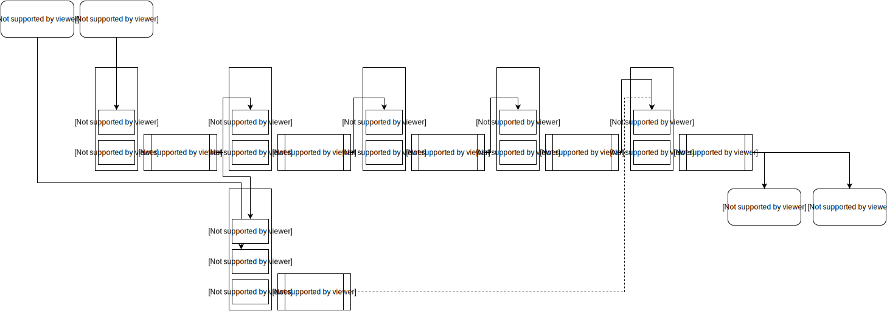

# Introduction

Open Avatar Chat is a modular interactive digital human dialogue implementation that can run full functionality on a single PC. It supports cloud-based APIs for ASR + LLM + TTS or local multimodal language models.

## Requirements

* Python version >=3.11.7, \<3.12
* CUDA-enabled GPU
* The digital human component can perform inference using GPU/CPU. The test device CPU is i9-13980HX, achieving up to 30 FPS for CPU inference.

> [!TIP]
> Using cloud APIs for ASR + LLM + TTS can greatly reduce hardware requirements. See [Bailian API config](/en/getting-started/liteavatar).

## Component Dependencies

| Type | Open Source Project | GitHub | Model |
|----------|-------------------------------------|---|---|
| RTC | HumanAIGC-Engineering/gradio-webrtc | [GitHub](https://github.com/HumanAIGC-Engineering/gradio-webrtc) | |
| WebUI | HumanAIGC-Engineering/OpenAvatarChat-WebUI | [GitHub](https://github.com/HumanAIGC-Engineering/OpenAvatarChat-WebUI) | |
| VAD | snakers4/silero-vad | [GitHub](https://github.com/snakers4/silero-vad) | |
| Avatar | HumanAIGC/lite-avatar | [GitHub](https://github.com/HumanAIGC/lite-avatar) | |
| TTS | FunAudioLLM/CosyVoice | [GitHub](https://github.com/FunAudioLLM/CosyVoice) | |
| Avatar | aigc3d/LAM_Audio2Expression | [GitHub](https://github.com/aigc3d/LAM_Audio2Expression) | [HuggingFace](https://huggingface.co/3DAIGC/LAM_audio2exp) |
| | facebook/wav2vec2-base-960h | | [HuggingFace](https://huggingface.co/facebook/wav2vec2-base-960h) / [ModelScope](https://modelscope.cn/models/AI-ModelScope/wav2vec2-base-960h) |
| Avatar | TMElyralab/MuseTalk | [GitHub](https://github.com/TMElyralab/MuseTalk) | |
| Avatar | Soul-AILab/SoulX-FlashHead | [GitHub](https://github.com/Soul-AILab/SoulX-FlashHead) | [HuggingFace](https://huggingface.co/Soul-AILab/SoulX-FlashHead-1_3B) |
